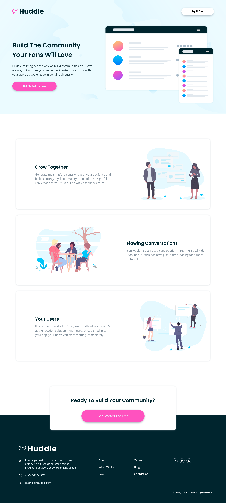

# Frontend Mentor - Huddle landing page with alternating feature blocks solution

This is a solution to the [Huddle landing page with alternating feature blocks challenge on Frontend Mentor](https://www.frontendmentor.io/challenges/huddle-landing-page-with-alternating-feature-blocks-5ca5f5981e82137ec91a5100).

### Screenshot

### Links

- Solution URL: [Solution URL here](https://www.frontendmentor.io/solutions/huddle-landing-page-with-alternating-feature-blocks-7zIeFvKVfR)
- Live Site URL: [Live site URL here](https://donjr2.github.io/Frontend-Mentor---Huddle-landing-page-with-alternating-feature-blocks-solution/)

### Built with

- Semantic HTML5 markup
- CSS custom properties
- Flexbox
- CSS Grid
- Mobile-first workflow

## Author

- Frontend Mentor - [@Tuhin-jr](https://www.frontendmentor.io/profile/Tuhin-jr)
